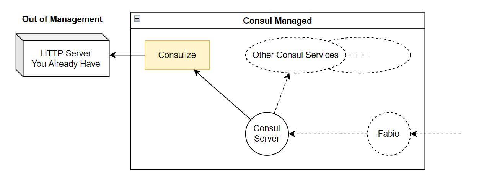

# Consulize
<h2><center> Make every HTTP server under Consul. </center></h2>

<hr>

A very light-weight reverse proxy service mesh, registered to [Consul](https://github.com/hashicorp/consul), proxying to your own URLs. No more modification into your existing servers.

If you are using load balance or routing tools, like [Fabio](https://github.com/fabiolb/fabio), `Consulize` may bring exciting routes tastes to you.



## Installation
### With Docker
`docker pull rickonono3/consulize:latest`

See the [compose example](docker-compose.yml)

### With Standalone Binaries
See the repository's [Releases](), and [How to `run-consulize.sh`](run-consulize.sh)

### From Source
You can easily build a single-file executable in your machine by using Go programming language:
```bash
git clone https://github.com/rickonono3/consulize # or download a source archive
cd consulize
go get
go build -o consulize .
/bin/bash run-consulize.sh
```

## Usage
Consulize is configured by environment variables. Below is some of them (Other Configurables of Consul in [doc](https://pkg.go.dev/github.com/hashicorp/consul/api@v1.14.0#HTTPAddrEnvName))

|Env|Default Value|Description|
|---:|---------|-----------|
|TARGET|http://127.0.0.1:80|Full URL to your existing server|
|TAGS|[ ]|Tags when registering to Consul. <br>Must be a JSON ARRAY
|TAGS_FILE| |Path to a JSON file. Same format to `TAGS`, they will be merged together
|CONSUL_HTTP_ADDR|127.0.0.1:8500|`host:port` to a Consul Server|
|CONSUL_HTTP_TOKEN|
|CONSUL_HTTP_TOKEN_FILE|
|SERVICE_NAME|consulize|Your own service name|
|SERVICE_ID|`<serviceName>-<randomInt>`|Your own service id|
|SERVICE_HOST_FROM_CONSUL|127.0.0.1|The `host`, where Consul sends requests to `Consulize`.
|SERVICE_PORT|8890|The `port` `Consulize` would listen on.
|SERVICE_NAMESPACE|
|SERVICE_PARTITION|
|TRANSMIT_HEALTH|false|Check health of the target server self instead of `Consulize`|
|HEALTH_PATH|/health
|HEALTH_TIMEOUT|3s
|HEALTH_INTERVAL|5s
|DEREGISTER_CRITICAL_SERVICE_AFTER|30s|Automatically deregister after check fails for a period of time
